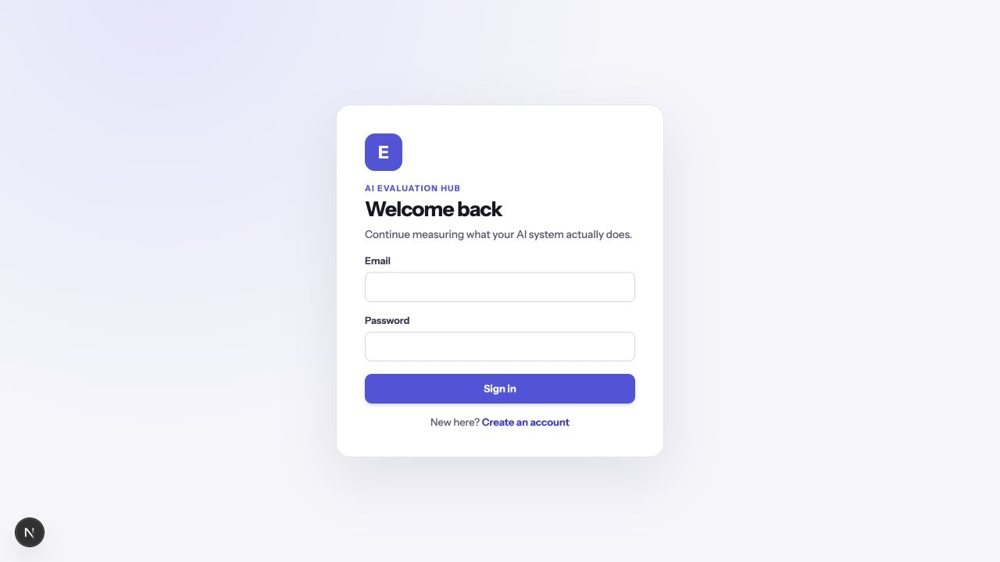
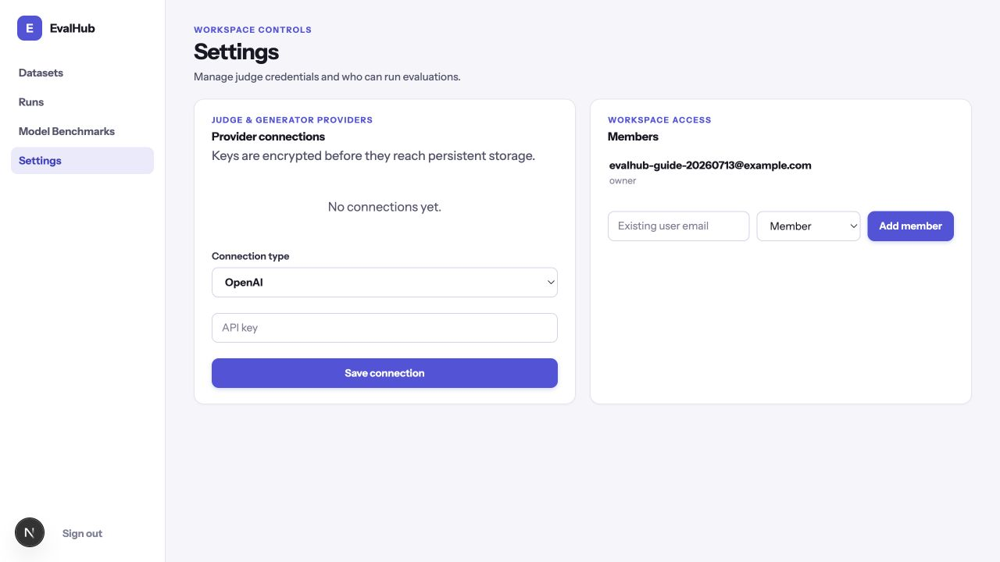
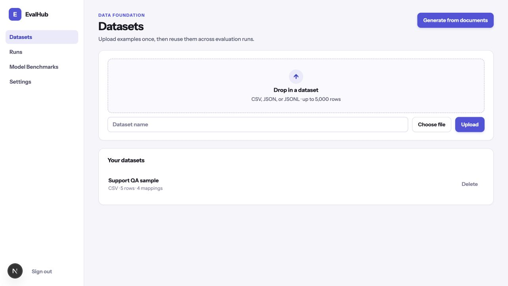
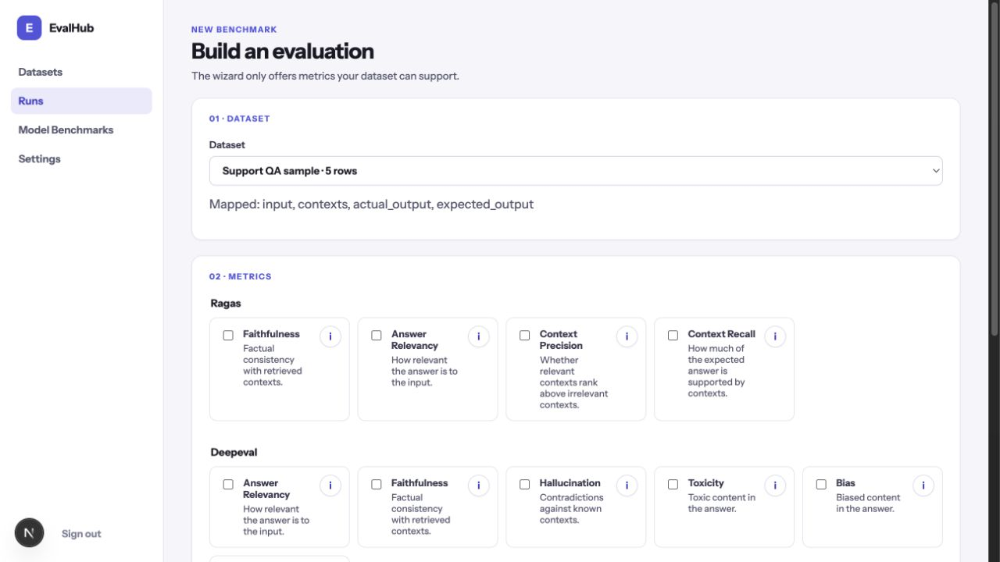
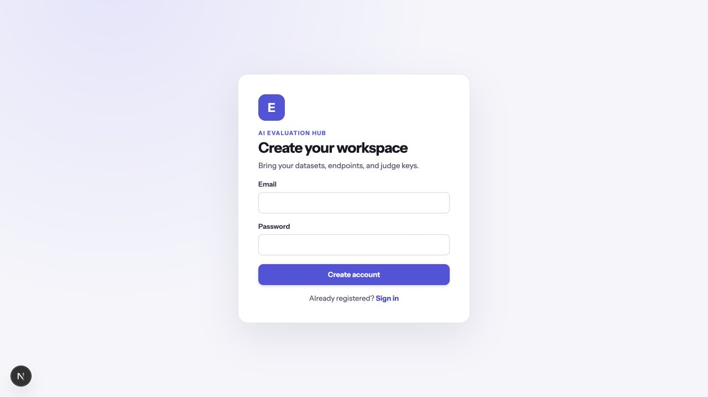
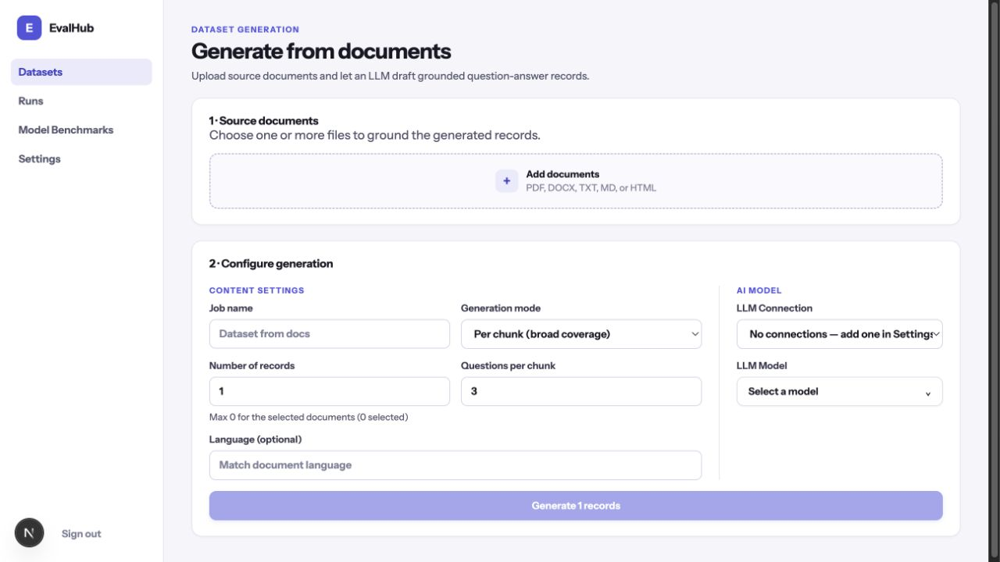
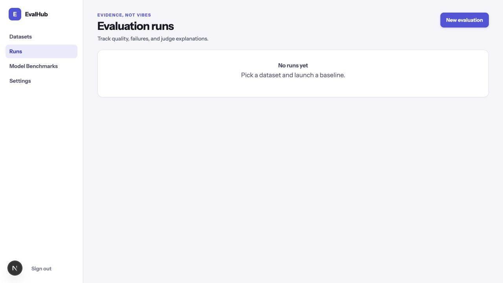
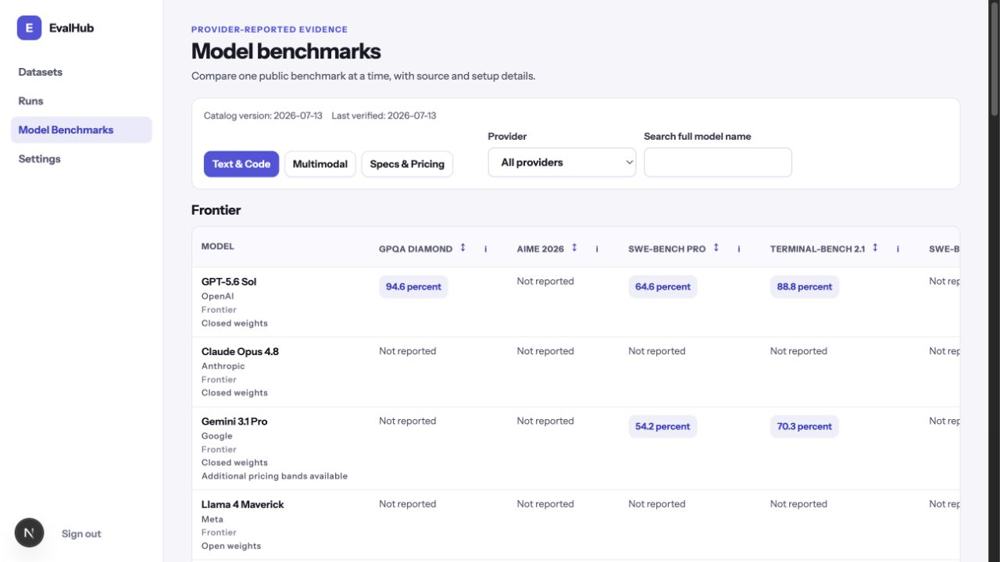

# AI Evaluation Hub User Guide

This guide is for product and evaluation users. It shows how to prepare data, run an evaluation, and understand the result without requiring technical experience.

The screenshots use safe illustrative states. They intentionally omit account details, API keys, endpoints, and source-document content.

## Quick Start

**Goal:** run a small evaluation of answers that are already in your dataset.

### 1. Sign in or create an account

Open the sign-in page, enter your work email and password, then select **Sign in**. New users can select **Create an account** and use the same form to create their workspace.

### 2. Add a provider connection

Open **Settings** from the left navigation. Under **Provider connections**, select the connection type, add the requested details, and select **Save connection**. The application verifies the connection before it saves it.

- Choose **OpenAI** or **Anthropic** for a standard provider key.
- Choose **OpenAI-compatible** for another compatible service. Give it a clear name and base URL; its key may be optional.

> **Keep it safe.** Treat an API key like a password: never put it in a dataset, report, screenshot, or shared message. Your provider may charge for model and embedding requests, so start with a small dataset and a single metric.

### 3. Upload a small dataset

Open **Datasets**, give the dataset a clear name, and upload a CSV, JSON, or JSONL file. Map the columns when prompted:

| Your column contains | Map it as |
| --- | --- |
| The question or prompt | `input` |
| The ideal/reference answer | `expected_output` |
| Retrieved passages or supporting material | `contexts` |
| The answer produced by your product | `actual_output` |

For this first evaluation, include at least `input` and `actual_output`. Add `contexts` and `expected_output` when your selected metric needs them.

### 4. Build and launch an evaluation

Open **Runs** and select **New evaluation**.

1. Select the dataset.
2. Select one metric. The wizard only enables metrics that your mappings can support.
3. Choose **Dataset answers** as the answer source.
4. Give the run a name, select a provider connection and model, then select **Launch evaluation**.

### 5. Open the completed result

Return to **Runs**. A running evaluation shows its progress; when it is **Completed**, open it to see the report. The report gives you an overall score, per-row evidence, and export options.

That is your first success: a repeatable, named evaluation run whose evidence you can inspect and share.

---

## Advanced Reference

Use this section when you need a specific screen or task.

| If you want to… | Go to… |
| --- | --- |
| Sign in, create an account, or switch to registration | **Sign in** / **Create account** |
| Upload, map, or remove evaluation data | **Datasets** |
| Turn documents into question-and-answer records | **Datasets** → **Generate from documents** |
| Start, monitor, cancel, or open an evaluation | **Runs** |
| Configure evaluation inputs, metrics, and answer sources | **Runs** → **New evaluation** |
| Inspect scores, row evidence, and exports | Open a completed run |
| Compare public model information | **Model Benchmarks** |
| Manage provider connections and workspace members | **Settings** |

### Sign in and registration

Use **Sign in** when you already have an account. Use **Create an account** if you are new; registration creates a workspace for you. Passwords must be at least eight characters. Use **Sign out** in the left navigation when you finish on a shared device.

### Datasets: upload and map records

The **Datasets** screen is the starting point for evaluations. You can upload CSV, JSON, or JSONL files of up to 5,000 rows.

- Give each dataset a name that explains its purpose, such as `Support answers — July sample`.
- Review the small preview, then map its columns to the meanings above.
- Only `input` is required to save a mapping, but the metrics and answer modes available later depend on the fields you mapped.
- Select **Delete** only when the dataset is no longer needed; removing it also removes it from this workspace.

Use a small, non-sensitive sample first. Do not upload customer conversations, credentials, private documents, or personal data unless your organization has approved sharing that material with the selected provider.

### Generate a dataset from documents

From **Datasets**, select **Generate from documents** to create question-and-answer records from source files. You can add PDF, DOCX, TXT, Markdown, or HTML files.

1. Add the documents, then move to **Configure**.
2. Name the job and choose **Per chunk** for several focused questions, or **Whole document** for broader questions.
3. Choose the number of records, an optional language, and the provider connection and model.
4. Launch the job. The job list shows progress; you can cancel a pending or running job.
5. When it completes, select **Review**. You can edit a question, answer, or context; delete or restore a record; and then save the approved records as a dataset.

> **Source-data note.** Generation sends document content to the provider connection you choose. Use only documents that are appropriate to share with that provider, and keep the first job small to understand possible provider charges.

### Runs and evaluation reports

The **Runs** screen lists each evaluation and its status. Select **New evaluation** to start another one. Pending and running evaluations can be cancelled.

Open a completed run to view its report. The report lets you:

- Read the overall mean score and pass rate.
- Compare metric scores and their score distribution.
- Sort rows by metric, or show only failures.
- Expand a row to inspect its input, actual answer, contexts, reasons, errors, and latency.
- Export the result as HTML, CSV, or JSON.

Use a report to find patterns, not only a single headline score. For example, inspect failed rows before changing a prompt, retrieval setup, or model.

### New evaluation: choosing metrics and answer sources

The evaluation wizard uses four steps: dataset, metrics, answer source, and judge/launch.

**Metrics.** Select one or more metrics. A disabled metric needs a field that is not mapped in the selected dataset; the wizard shows which field is missing. Select its information button to read what it measures. Some answer-relevancy setups also require an embedding connection and model; choose an OpenAI or OpenAI-compatible embedding connection when the wizard requests one.

**Dataset answers.** Choose this when each record already has an `actual_output` field. It is the simplest way to evaluate a saved set of answers.

**Live endpoint.** Choose this when EvalHub should call your application for each input. Provide the endpoint URL, HTTP method, optional headers, a JSON request template, and the JSON path that identifies the answer in the response (for example, `$.answer`). Test with a non-sensitive endpoint and data first. Do not place passwords, private tokens, or customer data in headers or the request template.

**Judge and launch.** Choose the provider connection and model that will judge the answers, name the run, then launch it. The run uses the selected provider, so its requests can incur provider charges.

### Model Benchmarks: browse public evidence

**Model Benchmarks** is a reference catalog for comparing public, provider-reported information. It does not run your data.

- Switch among **Text & Code**, **Multimodal**, and **Specs & Pricing**.
- Filter by provider or search the full model name.
- Select a column heading to sort a benchmark.
- Select the information button beside a benchmark to read what it measures and its limitations.
- Select a model or a score to open its source, method, setup, and verification details.

Compare models within the published setup. A score from one benchmark or provider announcement is useful evidence, but it is not a guarantee of performance on your own data.

### Settings: connections and members

In **Settings**, use **Provider connections** to add or remove the models used for generation and judging. Connection keys are encrypted before persistent storage, but you should still share access carefully and remove unused connections.

Use **Members** to give an existing user access to the workspace. Enter their registered email address, choose **Member** or **Owner**, and select **Add member**. Owners can manage workspace access; assign that role only to people who need it.

---

## A simple, safe working pattern

1. Start with a small, non-sensitive dataset.
2. Use one metric and one provider model.
3. Inspect failed rows and improve the underlying product or data.
4. Run the same named evaluation again to compare the change.
5. Export only the result information that is safe to share.

This keeps early evaluations understandable, limits provider cost, and makes improvements easier to verify.
